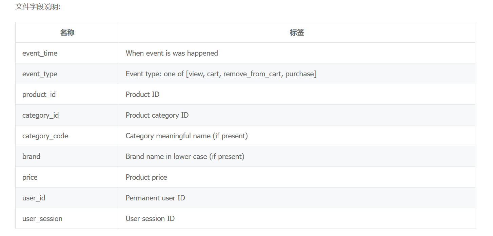
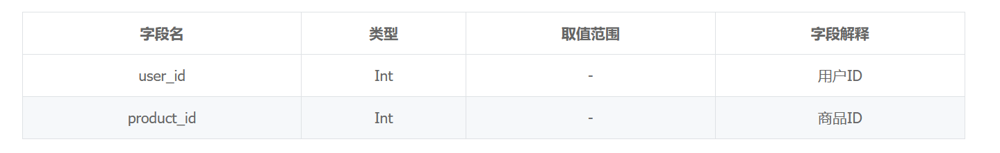

# 实验说明及安排
## 数据说明：
[train.csv](./train.csv)中包括了用户1-用户53975的过往行为，字段说明如下：

[test.csv](./test.csv)中包括了用户53978-用户67469的过往行为，字段和上图一样

[submit_example.csv](./submit_example.csv)中包括了我们要提交的文件格式，字段如下：

即对测试集的每一个用户，给出他最有可能购买的下一个商品

## 实验目标：
对测试集的每一个用户，给出他最有可能购买的下一个商品

## 思路：
用Transformer预测。

0. 超参
    ||数值|描述|
    |----|----|----|
    |truncation|20|将数据集重新划分后，每个用户对应的时间序列长度，超过这个值的做截断，不足的做padding|
    |d_model|512|将每条记录映射到的embedding向量的维度，由product_embedding(507)和event_embedding(5)拼接而成|
    |nhead|8|多头Tranformer头的数量|
    |episodes|TBD|训练轮数|
    |batch_size|TBD||
    |...|

1. 数据处理
    1. 提取*训练集*的 `product_id`, `event_type`, `user_id` 列，根据 `user_id` 将数据集重新划分，每个 user 对应一串长为 `truncation` 的行动序列
2. 构建 Transformer 模型 `EBModel`
    1. 使用 `nn.embedding`，将每个商品和 *padding* （共32734+1个）embedding 到一个长为507维的向量中;将每一种行为和 *padding*（共4+1个）同样embedding到一个长为5维的向量中
    2. 根据超参构建 Transformer 模型（Encoder层、位置编码等）
    3. 定义两个线性 Decoder，`prod_linear`用来输出对应的商品index，`event_linear`用来输出对应的用户行为
3. 训练模型
4. 测试模型（包括调参）
    1. 用与*训练集*同样的方法提取*测试集*的每一个人的数据
    2. 对每一个要预测的 user，将他当前的行动序列输入给训练好的 `EBModel`，若`event_linear`的结果是 *purchase*，则输出`prod_linear`的结果，否则将这个向量加入该用户的行动序列，重复该步骤。

## 分工：
邬靖宇：1.2
郑鹏飞：3
李泽林：4